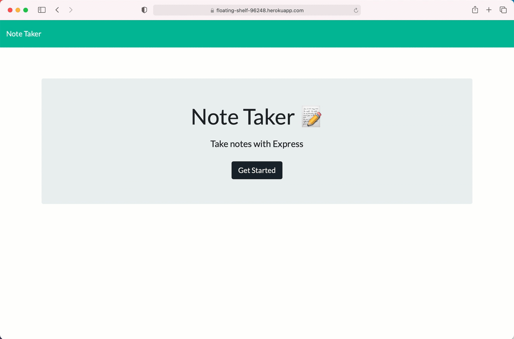

# Note Taker

## Description

A application that can be used to write, save, and delete notes. This application use an express backend and save and retrieve note data from a JSON file.

## User Story

AS A user, I want to be able to write and save notes

I WANT to be able to delete notes I've written before

SO THAT I can organize my thoughts and keep track of tasks I need to complete

## Business Context

For users that need to keep track of a lot of information, it's easy to forget or be unable to recall something important. Being able to take persistent notes allows users to have written information available when needed.


## Deploying the App

This app should is deployed on Heroku. 
- [Heroku App](https://floating-shelf-96248.herokuapp.com)

- - -

## Visuals 

```
As a manager
I want to generate a webpage that displays my team's basic info
so that I have quick access to emails and GitHub profiles
```

  
  

---


## Repository
- [Project Repo](https://github.com/AlheliMi/Note_Taker.git)
- [Project Link](https://alhelimi.github.io/Note_Taker/)

## Questios, Coments, Sugestions
If you have any questios about the repo, you can open an issue or contact directly to me at alhealhe72@hotmail.com. Or at gitHub AlheliMi.